# Pepper Watch

[](https://github.com/TristanListanco/Pepper-Watch/actions/workflows/tests.yml)
[](https://github.com/TristanListanco/Pepper-Watch/actions/workflows/static-analysis.yml)

On-device aphid detection for bell pepper fields. Point an iPhone or iPad at the plants and Pepper Watch finds each leaf, tells you whether aphids have damaged it, and keeps a history of every field — all on the device, with no network connection. A companion Apple Watch app and widgets show each field's status at a glance.

Pepper Watch is the mobile companion to the thesis *Development of YOLOv8n Aphid Damage Detection and Offline Monitoring for Bell Pepper (Capsicum annuum) on Raspberry Pi 5* (MSU–Iligan Institute of Technology). It brings the same detector and severity scale to the phone a farmer already carries.

## What it does

- **Detects aphid damage in real time.** The camera feed runs through a YOLO object detector in Core ML, which boxes every leaf as *aphid-infested* or *healthy*. You can also analyze a photo from your library.
- **Turns counts into a severity level.** Each scan gets the thesis's actionable status: **Healthy** (no aphids), **Low** (under 25% of leaves infested), **Moderate** (25–50%) or **Severe** (50% and up), with what to do next.
- **Ties scans to fields.** Fields are drawn as geofences on a map, so the app knows which field you're standing in and marks scans made inside it as verified.
- **Tracks fields over time.** Insights chart the infestation rate, leaf health and scanning activity by day, week, month, six months or year, and Apple Intelligence writes a short briefing of what changed (with a rule-based summary when it isn't available).
- **Keeps a full history.** Every scan is saved with its photo and boxes. You can review each leaf, read a plain-language insight about the photo, share a PDF report, drag photos into other apps, and export scans and sessions as CSV.
- **Reaches beyond the app.** Home Screen and Lock Screen widgets, an interactive widget for switching fields, a Control Center control to start scanning, Siri and Shortcuts actions ("Check Aphid Status", "Summarize My Fields", "Start Scanning", "Show Insights"), and Spotlight.
- **Comes to your wrist.** The Apple Watch app shows every field's week with the Digital Crown, offers Smart Stack widgets that appear when you arrive at a field, answers "Check Field" with Siri, and hands off to the iPhone.
- **Stays private.** Scans, photos and locations stay on your iPhone and paired Apple Watch. The app works fully offline.

## Screens

### iPhone and iPad

<table>
  <tr>
    <td align="center" width="25%">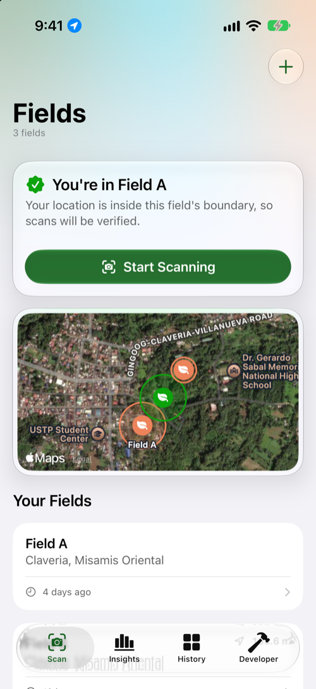<br><b>Fields</b><br><sub>Your fields on a map, and which one you're in</sub></td>
    <td align="center" width="25%">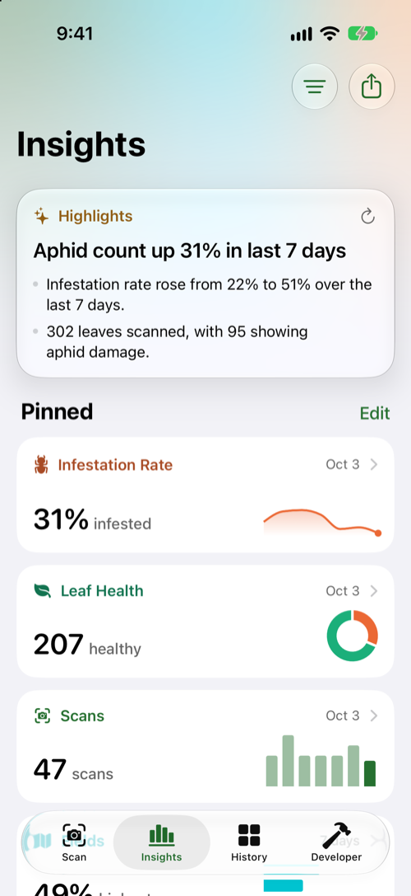<br><b>Insights</b><br><sub>An on-device briefing and the metrics you pin</sub></td>
    <td align="center" width="25%">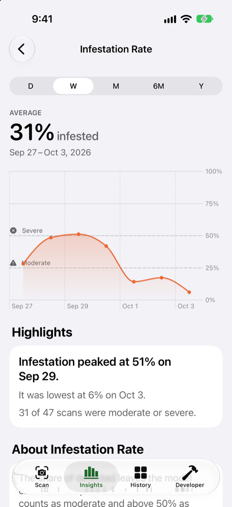<br><b>Metric detail</b><br><sub>Trends against the severity thresholds</sub></td>
    <td align="center" width="25%">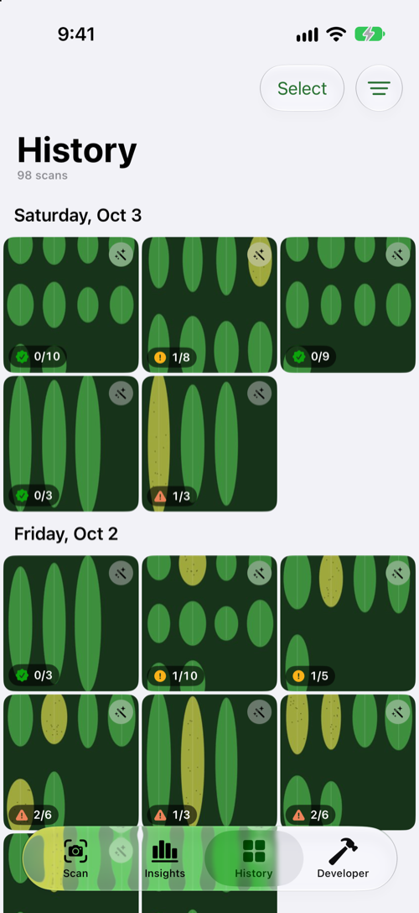<br><b>History</b><br><sub>Every scan, grouped by day</sub></td>
  </tr>
  <tr>
    <td align="center">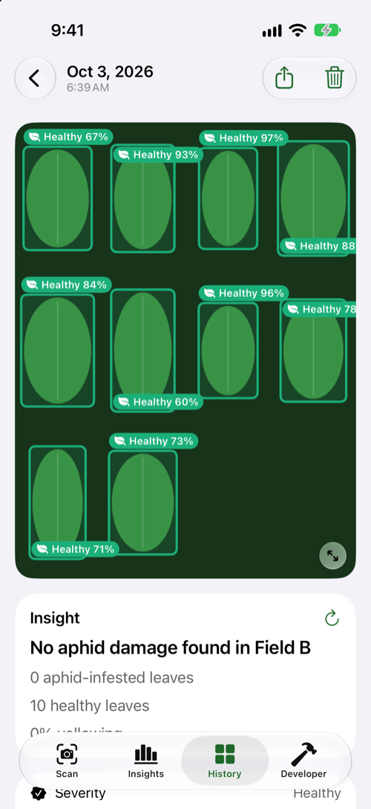<br><b>Scan detail</b><br><sub>Detected leaves and a plain-language insight</sub></td>
    <td align="center">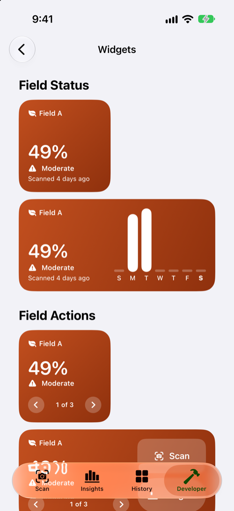<br><b>Widgets</b><br><sub>Field Status and the interactive Field Actions</sub></td>
    <td align="center">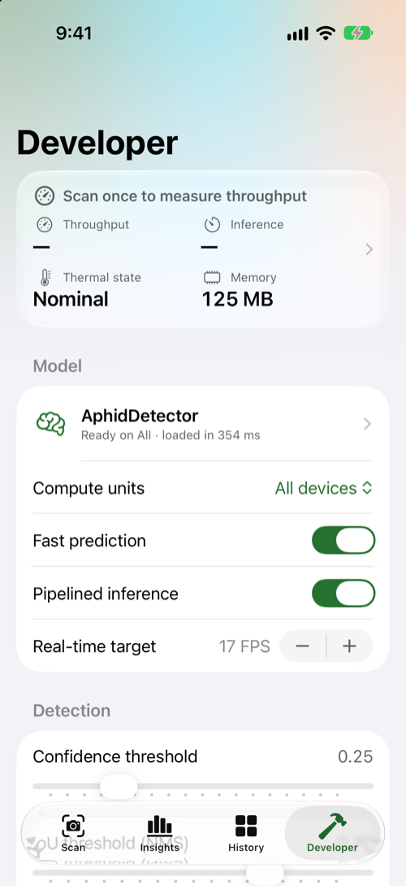<br><b>Developer</b><br><sub>Live performance and detector settings</sub></td>
    <td></td>
  </tr>
</table>

On iPad the tabs become a sidebar, and the menu bar offers New Field and Go commands.

### Apple Watch

<table>
  <tr>
    <td align="center">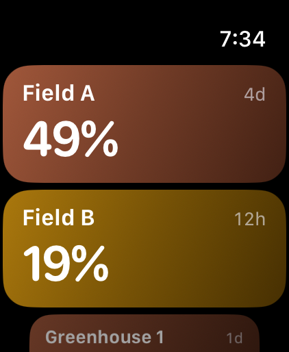<br><b>Your fields</b></td>
    <td align="center">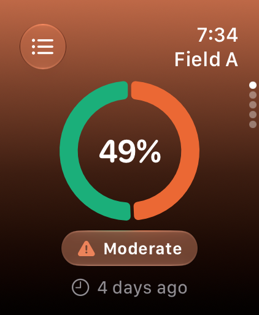<br><b>Summary</b></td>
    <td align="center">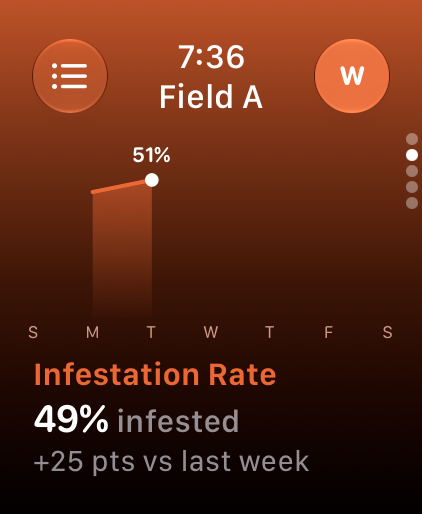<br><b>Infestation</b></td>
    <td align="center">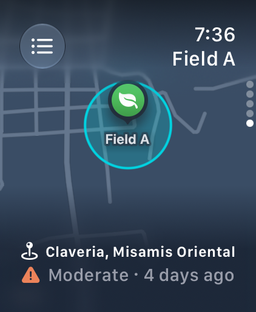<br><b>Location</b></td>
    <td align="center">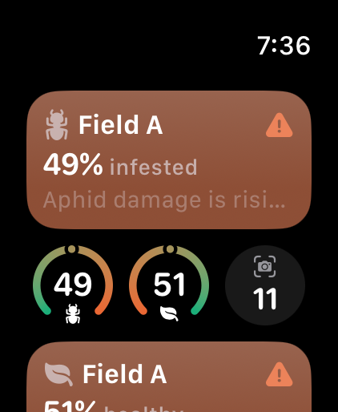<br><b>Widgets</b></td>
  </tr>
</table>

## Tech stack

| Area | Technologies |
| --- | --- |
| Language and UI | Swift, SwiftUI with Liquid Glass, Observation, Swift Charts, MapKit, TipKit, UIKit for the camera preview |
| On-device ML | Core ML with an Ultralytics YOLO model (640×640 input, built-in NMS, aphid-infested and healthy classes), Vision, AVFoundation for the camera, Core Image and ImageIO |
| Apple Intelligence | Foundation Models for the Insights briefing and per-scan insights, with rule-based fallbacks |
| Data | SwiftData (with sectioned queries), App Groups shared with the widgets and watch, Transferable and Uniform Type Identifiers for sharing, drag and drop, and CSV export |
| Location | Core Location (`CLServiceSession`, `CLLocationUpdate`) and Core Location UI for field geofences and scan verification |
| System integration | WidgetKit (widgets, controls, Smart Stack relevance with RelevanceKit), App Intents for Siri and Shortcuts, Core Spotlight, Handoff, BackgroundTasks, LinkPresentation |
| Apple Watch | SwiftUI for watchOS, WatchConnectivity sync from the iPhone, WidgetKit Smart Stack widgets, App Intents, background refresh |
| Diagnostics | MetricKit daily reports with app state reporting, OSLog, an in-app performance monitor and system log |
| Quality | Swift Testing, XCTest UI tests with accessibility audits, SwiftLint, GitHub Actions |

The detector ships as `AphidDetector.mlpackage`, exported from Ultralytics with confidence 0.25 and IoU 0.70 defaults; the Developer tab's Model Card shows its metadata and license (AGPL-3.0).

## Project layout

| Folder | Contents |
| --- | --- |
| `Pepper Watch/` | The iPhone and iPad app: camera and detection, features by tab, persistence, services, App Intents and the Core ML model |
| `PepperWatchWidgets/` | Home Screen and Lock Screen widgets and the Scan Leaves control |
| `PepperWatchWatchApp/` | The Apple Watch app |
| `PepperWatchWatchWidgets/` | Smart Stack widgets for the watch |
| `Shared/` | Code shared across targets: severity, widget snapshot, watch payload, relevance, widget views |
| `WatchShared/` | Code shared by the watch app and its widgets |
| `PepperWatchTests/`, `PepperWatchWatchTests/`, `PepperWatchUITests/` | Unit, static analysis and UI accessibility tests |

## Requirements

- Xcode 27
- iOS / iPadOS 27 and watchOS 27
- A free Apple developer account is enough; the app uses no paid-only capabilities.

## Running the app

Open `Pepper Watch.xcodeproj`, choose the **Pepper Watch** scheme (or **PepperWatchWatchApp** for the watch) and run. Debug builds accept launch arguments for demos and screenshots:

| Argument | Effect |
| --- | --- |
| `-PWSeedDemo YES` | Fills an empty store with demo fields and scans |
| `-PWInitialTab scan\|insights\|history\|developer` | Opens a tab |
| `-PWInsightMetric infestation` | Opens a metric's detail page |
| `-PWOpenLatestScan YES` | Opens the newest scan |
| `-PWDeveloperPage widgets\|model\|performance\|sessions` | Opens a Developer page |
| `-PWHideTips YES` | Hides first-run tips (iPhone and watch) |
| `-PWWatchScope list\|firstField`, `-PWWatchPage infestation\|leafHealth\|scans\|location`, `-PWWatchWidgetGallery YES` | Watch screens |

The screenshots above were taken on an iPhone 17 and an Apple Watch Ultra 4 simulator with these arguments.

## Running the tests

The app and the watch app each have a Swift Testing suite. In Xcode, choose the **Pepper Watch** or **PepperWatchWatchApp** scheme and press ⌘U, or run them from the command line:

```sh
xcodebuild test -project "Pepper Watch.xcodeproj" -scheme "Pepper Watch" \
  -destination "platform=iOS Simulator,name=iPhone 17"

xcodebuild test -project "Pepper Watch.xcodeproj" -scheme PepperWatchWatchApp \
  -destination "platform=watchOS Simulator,name=Apple Watch Ultra 4 (49mm)"
```

The **Pepper Watch** scheme also runs `PepperWatchUITests`, which runs Xcode's accessibility audit (contrast, element descriptions, hit regions, Dynamic Type, clipped text and traits) on each screen of the app, opened on demo data. Element descriptions, hit regions, traits and clipped text gate the build. Contrast and text detection are measured from rendered pixels and vary between simulators, so their findings, like the Dynamic Type findings the app has today, are reported as expected failures: they stay visible in the test report without failing the run.

The [Tests workflow](.github/workflows/tests.yml) runs all of these on every pull request and every push to `main`.

## Static analysis

Two layers check the code without running the app:

- **SwiftLint** lints every target with the rules in [`.swiftlint.yml`](.swiftlint.yml). Install it with `brew install swiftlint` and run `swiftlint` from the repository root.
- **`StaticAnalysisTests`**, a Swift Testing suite in `PepperWatchTests`, reads the Xcode project and the sources each target compiles. It checks that SF Symbol and asset names resolve, that every SwiftData model is in the schema, that privacy-protected APIs have usage descriptions, that entitlements work with a free developer account, and that shipped code has no `print` calls, leftover TODOs or plain-HTTP URLs. It runs with the other tests on ⌘U, and failures point at the offending line.

The [Static Analysis workflow](.github/workflows/static-analysis.yml) runs SwiftLint in strict mode and shows findings inline on pull requests. The Tests workflow also fails on any compiler warning.
